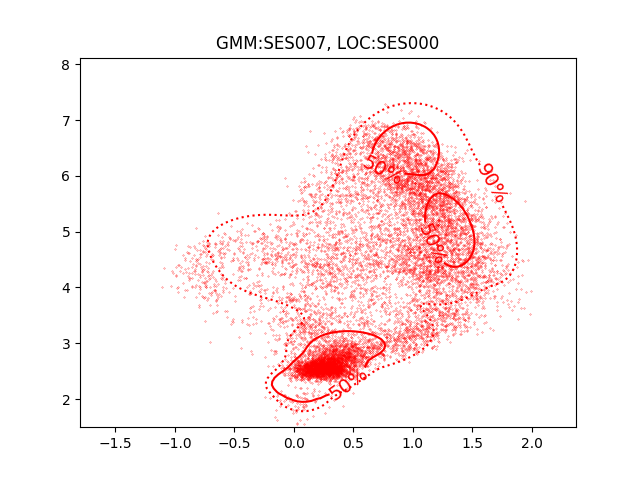

PAV - P4: reconocimiento y verificación del locutor
===================================================

Obtenga su copia del repositorio de la práctica accediendo a [Práctica 4](https://github.com/albino-pav/P4)
y pulsando sobre el botón `Fork` situado en la esquina superior derecha. A continuación, siga las
instrucciones de la [Práctica 3](https://github.com/albino-pav/P3) para crear una rama con el apellido de
los integrantes del grupo de prácticas, dar de alta al resto de integrantes como colaboradores del proyecto
y crear la copias locales del repositorio.

También debe descomprimir, en el directorio `PAV/P4`, el fichero [db_spk.tgz](https://atenea.upc.edu/pluginfile.php/3008277/mod_assign/introattachment/0/db_spk.tgz?forcedownload=1)
con la base de datos oral que se utilizará en la parte experimental de la práctica.

Como entrega deberá realizar un *pull request* con el contenido de su copia del repositorio. Recuerde
que los ficheros entregados deberán estar en condiciones de ser ejecutados con sólo ejecutar:

~~~~~~~~~~~~~~~~~~~~~~~~~~~~~~~~~~~~~~~~~~~~~~~~~~~~~.sh
  make release
  run_spkid mfcc train test classerr verify verifyerr
~~~~~~~~~~~~~~~~~~~~~~~~~~~~~~~~~~~~~~~~~~~~~~~~~~~~~

A modo de memoria de la práctica, complete, en este mismo documento y usando el formato *markdown*, los
ejercicios indicados.

## Ejercicios.

### Extracción de características.

- Escriba el *pipeline* principal usado para calcular los coeficientes cepstrales de predicción lineal
  (LPCC), en su fichero <code>scripts/wav2lpcc.sh</code>:

~~~~~~~~~~~~~~~~~~~~~~~~~~~~~~~~~~~~~~~~~~~~~~~~~~~~~~~~~~~~~~~~~~~~~~~~~~~~~~~~~~~~~~~~~~~~~~~~~.sh
                    **CODIGO DEL LPCC**
  sox $inputfile -t raw - dither -p12| $X2X +sf | $FRAME -l 200 -p 40 | $WINDOW -l 200 -L 200 |
	$LPC -l 200 -m $order_lpc | $LPC2C -m $order_lpc -M $order_cep > $base.lpcc
~~~~~~~~~~~~~~~~~~~~~~~~~~~~~~~~~~~~~~~~~~~~~~~~~~~~~~~~~~~~~~~~~~~~~~~~~~~~~~~~~~~~~~~~~~~~~~~~~
    
- Escriba el *pipeline* principal usado para calcular los coeficientes cepstrales en escala Mel (MFCC), en
  su fichero <code>scripts/wav2mfcc.sh</code>:

  ~~~~~~~~~~~~~~~~~~~~~~~~~~~~~~~~~~~~~~~~~~~~~~~~~~~~~~~~~~~~~~~~~~~~~~~~~~~~~~~~~~~~~~~~~~~~~~~~~.sh
                    **CODIGO DEL MFCC**
  sox $inputfile -t raw - dither -p12| $X2X +sf | $FRAME -l 200 -p 40 | $WINDOW -l 200 -L 200 |
	$MFCC -s $sampling_frequency -m $order -l 200 > $base.mfcc
~~~~~~~~~~~~~~~~~~~~~~~~~~~~~~~~~~~~~~~~~~~~~~~~~~~~~~~~~~~~~~~~~~~~~~~~~~~~~~~~~~~~~~~~~~~~~~~~~

- Indique qué parámetros considera adecuados para el cálculo de los coeficientes LPCC y MFCC.
    #### PARÁMETROS MFCC:
                        Filtros = 20
                        MFCC order = 12
                        Frec. de mustreo = 8 KHz
    #### PARÁMETROS LPCC:
                        LPC order = 25
                        Cepstrum order = 25

- Inserte una imagen mostrando la dependencia entre los coeficientes 2 y 3 de las tres parametrizaciones
  para una señal de prueba.
                                          DEPENDENCIA ENTRE LOS COEFICIENTES 2 Y 3; **LP**

  

                                          DEPENDENCIA ENTRE LOS COEFICIENTES 2 Y 3; **LPCC**

 

                                          DEPENDENCIA ENTRE LOS COEFICIENTES 2 Y 3; **MFCC**

 

  
  + ¿Cuál de ellas le parece que contiene más información?

    El primer paso en un sistema de procesado de voz es la extracción de características. En nuestro sistema hemos extraído estas características mediante la LP, LPCC y MFCC que nos porporcionan información para reconocer el hablante con un mejor o peor rendimiento.
    Fijándonos en la correlación que siguen los coeficientes de las tres parametrizaciones vemos que los coeficientes de la LP nos aportan menos información ya que están altamente correlados. En, cambio los coeficientes de la LPCC y MFCC están más dispersos y nos dan más información.
    Comparando la MFCC y LPCC, los coeficientes de la primera nos aportan más información ya que estos tienen en cuenta el conjunto de frecuencias en las cuales el oído humano es más sensible y provoca que la correlación de sus coeficientes sea menor y haya una mejor dispersión.

- Usando el programa <code>pearson</code>, obtenga los coeficientes de correlación normalizada entre los
  parámetros 2 y 3, y rellene la tabla siguiente con los valores obtenidos.

  |                        |    LP   |   LPCC   |  MFCC  |
  |------------------------|:-------:|:--------:|:----..:|
  | &rho;x[2,3] | -0.43509|0.0430681 |0.190129|
  
  + Compare los resultados de <code>pearson</code> con los obtenidos gráficamente.

  Utilizando el programa <code>pearson</code> hemos obtenido los coeficientes de correlación normalizada de la tabla anterior. Como podemos ver para la MFCC y la LPCC tenemos unos coeficientes cercanos al 0 lo que implica incorrelación entre los parámetros 2 y 3. Pero a diferencia de los resultados obtenidos gráficamente anteriormente la dispersión será mucho mayor para la LPCC ya que su coeficiente es mucho más cercano a 0 que el de la MFCC.
  Para la LP tenemos un coeficiente entre 0 y -1 cosa que implica que los parámetros 2 y 3 están bastante correlados, igual que en los casos de las gráficas.
  
### Entrenamiento y visualización de los GMM.

- Inserte una gráfica que muestre la función de densidad de probabilidad modelada por el GMM de un locutor
  para sus dos primeros coeficientes de LPCC.

   
  
- Inserte una gráfica que permita comparar los modelos y poblaciones de dos locutores distintos. Comente el
  resultado obtenido y discuta si el modelado mediante GMM permite diferenciar las señales de uno y otro.

   
  
   
   

  Como podemos ver las gráficas tienen un cierto parecido en cuanto a forma y regiones marcadas. Vemos dos zonas diferenciadas en lasgráficas, la da abajo a la izquierda probablemente corresponde al silencio de la señal y la de arriba a la voz del locutor. Las zonas de los silencios son muy parecidas, cosa que no cuadra mucho con la realidad (los silencios de cada señal son diferentes) y las de la voz también se parecen, pero las pequeñas diferencias en esa zona son las que permiten la diferenciación entre locutores mdiante el modelado de GMM.

  Podemos observar esa diferencia entre diferentes locutores cuando superponemos las gmm de uno con los valores de otra:
  
   
    

### Reconocimiento del locutor.

- Inserte una tabla con la tasa de error obtenida en el reconocimiento de los locutores de la base de datos
  SPEECON usando su mejor sistema de reconocimiento para los parámetros LP, LPCC y MFCC.

  |                        |  LP   | LPCC  |   MFCC  |
  |------------------------|:-----:|:-----:|:-------:|
  |  **Tasa de error**     | 12.87%| 0.64% | 12.55 % |

### Verificación del locutor.

- Inserte una tabla con el *score* obtenido con su mejor sistema de verificación del locutor en la tarea
  de verificación de SPEECON. La tabla debe incluir el umbral óptimo, el número de falsas alarmas y de
  pérdidas, y el score obtenido usando la parametrización que mejor resultado le hubiera dado en la tarea
  de reconocimiento.

  |                        |       LP       |       LPCC      |        MFCC      |
  |------------------------|:--------------:|:---------------:|:----------------:|
  |  **Umbral óptimo**     |1.46093073242201|0.661424219027104| 0.850388501099199|
  |  **Falsas alarmas**    |        0       |         0       |          0       |
  |  **Pérdidas**          |    218/250     |       26/250    |      232/250     |
  |  **SCORE**             |      87.2      |        10.4     |        92.8      |
 
 
### Test final y trabajo de ampliación.

- Recuerde adjuntar los ficheros `class_test.log` y `verif_test.log` correspondientes a la evaluación
  *ciega* final.

- Recuerde, también, enviar a Atenea un fichero en formato zip o tgz con la memoria con el trabajo
  realizado como ampliación, así como los ficheros `class_ampl.log` y/o `verif_ampl.log`, obtenidos como
  resultado del mismo.
